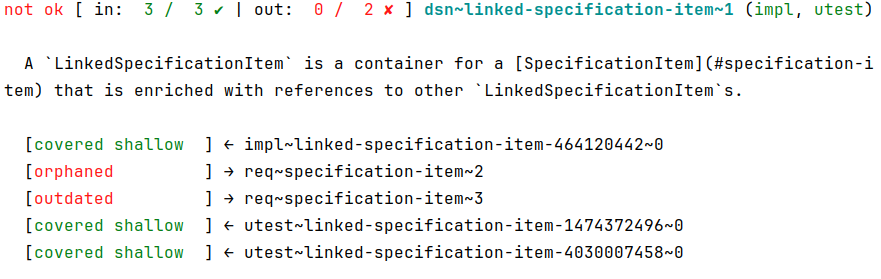
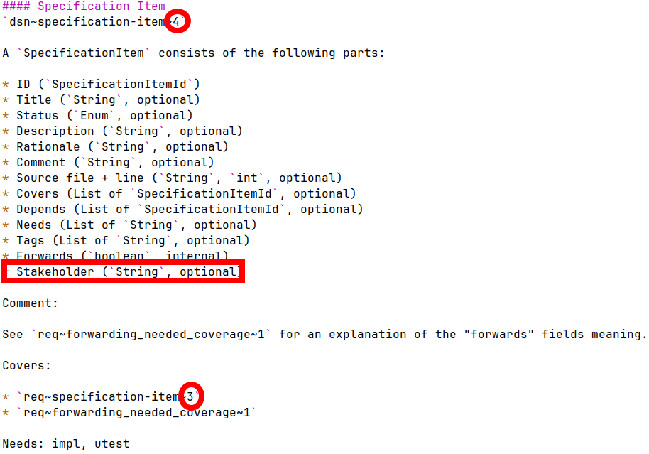
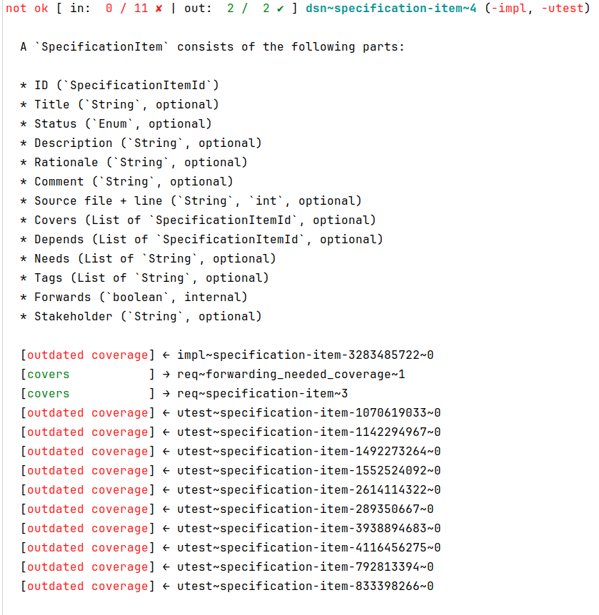

# OpenFastTrace Live Demo (Medium)

## Preparation

### Preconditions

The following software is needed to prepare and run this live demonstration

* bash
* maven
* Java 11 JDK (or newer, 17 or later recommended)
* GNU grep
* GNU sort
* GNU sed
* GNU uniq
* Text editor (e.g. vi)
* xmllint (optional but recommended)

#### On Debian / Ubuntu

The following was tested on Ubuntu 22.04 Server LTS (to use a small image), but should run on other comparable setups too.

While OFT still works with Java 11, at the time of this writing 11 is almost at its end-of-live, therefore the demo uses Java 17.

```bash
sudo apt install bash coreutils grep maven openjdk-17-jdk vim libxml2-utils
```

### Preparing the Directory That Contains OpenFastTrace

Run the following preparation ahead of your presentation so that you can dive in right away.

Set the necessary environment variables first. They are also needed in case you return later to an already set-up demonstration.

```bash
version='3.7.1'
project='openfasttrace'
demodir="$HOME/tmp/$project-demo-medium"
projectdir="$demodir/$project"
alias oft="java -jar $projectdir/product/target/$project-$version.jar"
```

Now clone the project for the demonstration.

```bash
mkdir -p "$demodir"
cd "$demodir"
git clone -b "$version" "https://github.com/itsallcode/$project"
cd "$projectdir"
mvn package
```

After that you will have a clone of the OFT repository in a specific version detached-head-mode.

Choosing a specific version is important to avoid surprises during the presentation in case OFT's behavior changed since this live demo script was written.

## Holding the Live Demonstration

The following sections contain a suggestion of what you can tell people interested in OFT about the project and what it is good for. As with every presentation it is better to memorize the general sequence instead of the wording. You are not reciting a poem, feel free to use your own words!

*("Stage directions" are written in parentheses and italics.)*

## Live Demo

### What is OFT?

OpenFastTrace is a requirement tracing suite. Simply put, requirement tracing makes sure that you don't forget stuff in your software project. That means that if you use OFT, you will not run into a situation where you have to explain to your customers why you forgot to implement a feature.

On the other hand OFT will tell you if there is code in your project where the original requirement has since been rejected, allowing you to clean up your code base and thus keep it maintainable and more secure.

OFT achieves this by crawling your specification documents and code and correlating them with the help of special IDs.

### Requirement IDs

The following command produces a list of all requirement IDs from OFT's feature list.

```bash
grep -Proh 'feat~.*?~[0-9]+' doc/spec/system_requirements.md | sort | uniq
```

Each ID consists of three parts:

1. Artifact type
2. Name or Number
3. Revision

Note that all parts are mandatory for an ID. The artifact type is used to tell requirement IDs in different documents and other sources apart. IDs are only guaranteed to be unique if you take all three parts into account. For example it is perfectly fine to have an ID `req~foobar~1` in a requirement specification and a `dsn~foobar~1` in the according design document. In fact this is a very common case. 

### Requirements in OFT

Let's have a look at the OFT system [requirement specification](https://github.com/itsallcode/openfasttrace/blob/develop/doc/system_requirements.md) to get an idea of context we use those IDs in.

```bash
grep -B 1 -A 33 'req~specification-item~' doc/spec/system_requirements.md
```

You see an excerpt of a specification document written in Markdown. More precisely you see a requirement with a title, a requirement ID and a description.

Incidentally I picked the requirement that defines a "Specification Item".

*(Go through the fields and explain them shortly to your audience.)*

This requirement states that it wants to be covered by a design.

### Specification Items vs. Requirements

In OFT we mostly talk about "Specification Item" which are a superset of requirements. The reason for this is that we want to treat markers in the code in the same way as requirements in a document when it comes to tracing. We will see what that means in a few minutes.

### Links to the Design

You saw that the requirement in the system specification requires coverage in a [design document](https://github.com/itsallcode/openfasttrace/blob/develop/doc/design.md). The easiest way for us to find this coverage - apart from using OFT - is to use a simple text search.

```bash
grep -n 'req~specification-item~' doc/spec/design.md
```

As you can see we get multiple matches. Each match is part of a design requirement that references the system requirement we saw earlier.

```bash
grep -B 20 -A 3 'req~specification-item~' doc/spec/design.md
```

### Code Decorations

In order to be able to tell where in your code a requirement is covered, you need to decorate your code with special tags contained in comments.

For the sake of simplicity we limit the command below to the `core/src` module directory, since we know the implementation is there. OFT is a multi-module-project, so searching all modules would require a little bit more command line magic but that is not what we want to focus on right now. 

```bash
grep -rnA 3 '~specification-item~' core/src | sed -e 's/java.*trace/.../'
```

You see a number of matches under `core/src/main/java` and `core/src/test/java`. As you might imagine those are the places where the design requirements are implemented and tested.

### OFT Modes

OFT has two modes of operation:
1. Tracer
2. Format converter

In this live demonstration we will focus mostly on the tracer since this is the core functionality.

While the converter is undoubtedly useful, it simply converts all its inputs into a specific requirements interchange format.

### Tracing OFT With Itself

You might have heard the term "eat your own dog food". This means that an organization should use its own products in order to share the customer's experience.

Of course, we do this with OpenFastTrace. So lets run a trace over our own sources.

```bash
oft trace doc/spec $(find . -name java)
```

The command above tells OFT to trace all requirement for the files in `doc/spec` and all `java` directories in the project. 

If there are no errors, the trace comes back with only a summary in the default verbosity level.

    ok - 282 total

### Finding Errors in the Tracing Chain

Let's intentionally brake the tracing chain.

We will increment the revision number of the system requirement we saw earlier so that the lower level requirements do not cover the system requirement anymore, so we expect OFT to complain about this.

```bash
vi doc/spec/system_requirements.md
```

Search in the requirement in `vi`:

```vi
/req\~specification-item
```

*(Increment the revision number and add a field "Stakeholder (optional)" for the sake of demonstration.)*

We now run the trace again.

```bash
oft trace doc/spec $(find . -name java)
```

And sure enough OFT points out that a few links are now outdated.

*(Walk the audience through the trace result. Explain what the symbols in front of the links mean. Take your time - this is one of the fundamental aspects of OFT.)*

Here is an example of on of the broken items:
 
> 

### Fixing an Error

We are now going to point the design specification item to the new version of the system requirement and in turn increment the version number of the design item.

```bash
vi doc/spec/design.md
```

Search for the specification item in the design document:

```
/req\~specification-item
```

There are three design items that refine the user requirement. One of them needs to change its content, the other ones just need to be checked, and we realize that no change is required. That is a situation that is very typical when you have refined requirements and change the ones on top.

Our first hit is `dsn~specification-item~3`. We read through the description and realize we have to add the new field "Stakeholder (`String`, optional)" here. Since we changed the design requirement, we also need to increment its revision, so that the ID is now `dsn~specification-item~4`. And of course, we fix the upward link, which now points to the new revision 3 of the user requirement `req~specification-item~3`.

Here is what that looks like:

> 

Additionally, we find `dsn~linked-specification-item~1` and `dsn~specification-item-id~1`, both of which require no change expect for fixing the broken link, so we just do that.

Again, we run the trace.

```bash
oft trace doc/spec $(find . -name java)
```

Now the problem is pushed down a level from the design to the implementation as you can see here:

> 

### Tracing Upward Only

Let's assume you are responsible for OFT's design document and someone else has the job to implement what you designed.

In this case you only care about if you covered the system requirements properly.

Next we are going to run a trace that focuses on this question only. We do this by filtering out all artifact types but `feat`, `req` and `dsn`. The first two are from the system requirements you need to cover, the last is what you are responsible for

```bash
oft trace -a feat,req,dsn doc/spec $(find . -name java)
```

This yields:

    ok - 94 total

As you can see at least from the perspective of the design document, everything is covered. Of course, we went from taking all 282 requirements into account down to only 94, but that was the point of the filter. While this doesn't mean the whole projects trace is green it at least proves that you in the role of the architect did your job.

### Controlling the Output

What if we want to see all specification items in the trace and not only the ones that failed?

OFT offers the following verbosity levels for the plain text report:

* Quiet - use exit code for example as build breaker
* Minimal - outputs "OK" or "FAIL"
* Summary - one line summary 
* Failures - list of IDs of defect items
* Failure Summaries - one line summary for every defect item
* Failure Details - detail information about defect items
* All - details for all items

```bash
oft trace -v all doc/spec $(find . -name java)
```

And if we want to find a specific requirement in that trace? Well, OFT is made for being used in command chains, so we can for example search the output for something that starts with `ok` followed later by that requirement ID.

```bash
oft trace -v all doc/spec $(find . -name java) | grep 'ok.*req~tracing.deep-coverage~1'
```

Which produces:

    ok [ in:  1 /  1 ✔ | out:  1 /  1 ✔ ] req~tracing.deep-coverage~1 (dsn)

One of the reasons OFT features a plain text report and has a command line interface is that this combination is ideal for chaining OFT with other popular command line tools like `grep`.

Even if OFT tried, it could never cover all use cases that you might come up with in your real world project. Instead of trying to be the Jack-of-all-trades OFT focuses on being easy to integrate with other tools.

**Do one thing. Do it well.**

Sounds familiar?

Let's take this one step further and filter a single result including details from the report.

```bash
id='req~tracing.deep-coverage~1'
oft trace -v all doc/spec $(find . -name java) | grep -Pzo 'ok.*'"$id"'.*(\n| .*\n)+'
```

This yields:

    ok [ in:  1 /  1 ✔ | out:  1 /  1 ✔ ] req~tracing.deep-coverage~1 (dsn)
    
    OFT marks a specification item as _covered deeply_ if this item - and all items it needs coverage from - are covered recursively.
    
    [covered shallow  ] ← dsn~tracing.deep-coverage~1
    [covers           ] → feat~requirement-tracing~1

If you think now: this command is madness - fair enough. The point is that through chaining OFT with other tools you can do things the designers of OFT didn't think of.

### Converting Specification Formats

While the importer of OFT automatically detects the format you feed into a trace, you might need to deliver specifications in a certain format to another organization.

OFT can work as converter. In this case the original content is converted into the target format of your choice.

The following command converts the system requirements and design of OFT into the ReqM2 format.

```bash
oft convert -o specobject doc/spec
```

*(The next step assumes you have `xmllint` installed. Of course, you can use other software to pretty print the XML output too)*

```bash
oft convert -o specobject doc/spec | xmllint --format - > /tmp/oft_specifications.xml
```

```bash
vi /tmp/oft_specifications.xml
```

### Which Exchange Formats Does OFT support?

* OFT native: Requirement-enhanced Markdown (in / out)
* ReqM2 (in / out)
* OFT code decoration (in)
* Reqm2 code decoration (in)

### Where to go From Here?
You can find documentation about OpenFastTrace on GitHub:

* [OpenFastTrace project page](https://github.com/itsallcode/openfasttrace)
* [Contributing to OFT](https://github.com/itsallcode/openfasttrace/CONTRIBUTING.md)
* [User guide](https://github.com/itsallcode/openfasttrace/blob/main/doc/user_guide.md)